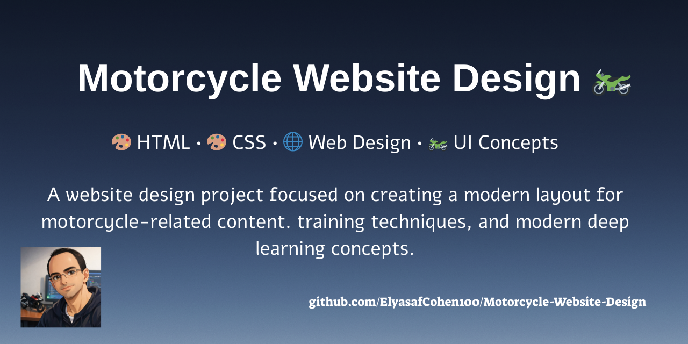
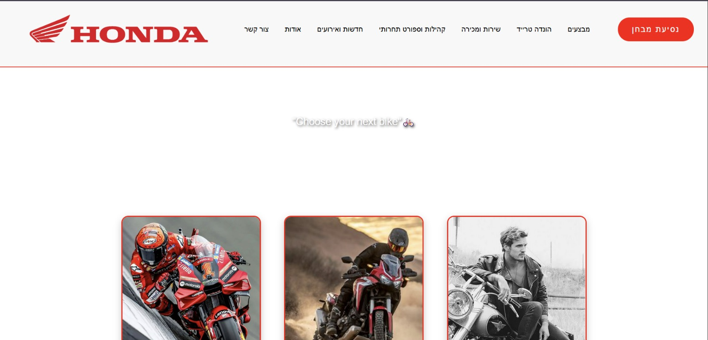
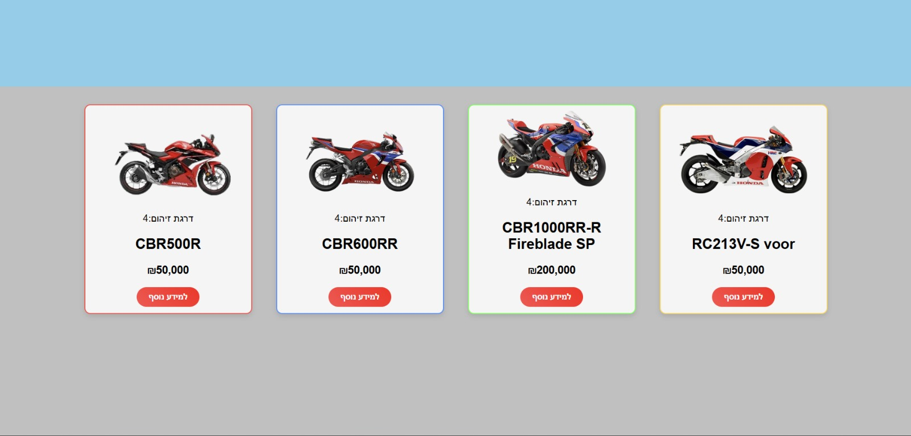
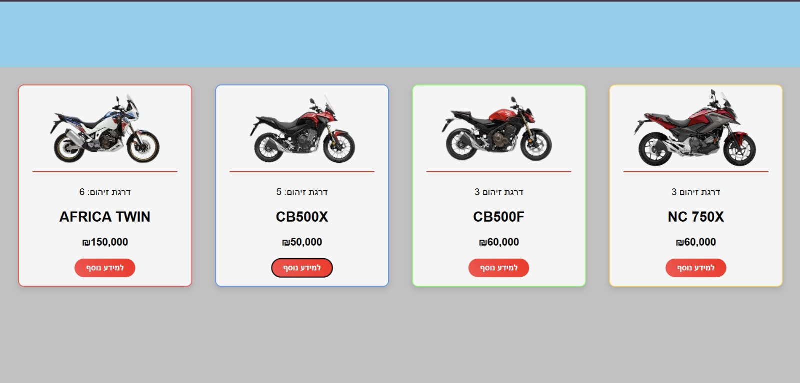
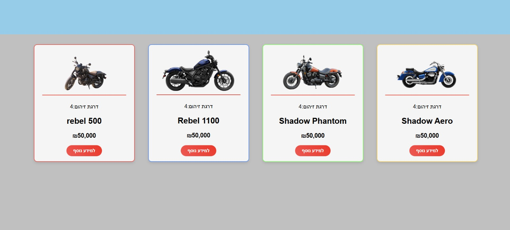

<p align="center">
  
</p> 

# Motorcycle Website Design 🏍️🌐🎨 


> **Frontend Web Design Project**
> A clean and stylish multi-page motorcycle showcase website built with pure HTML and CSS.

---

## 🏷️ Technologies & Tools


---

## ✨ Overview ✨

This project is a **multi-page motorcycle showcase website** designed to present different motorcycle categories in a clean and modern layout. 🏍️

The website demonstrates **frontend design fundamentals**, including:

* structured HTML pages
* CSS styling and layout design
* navigation between multiple pages
* responsive and visually organized components

Each section highlights a different motorcycle category, allowing users to explore **Sport**, **Adventure**, and **Custom** bikes. 💥🌪️✨

---

## 🎮 Website Sections 🎮

The website currently includes several pages:

* 🏠 **Home Page** – introduction and navigation
* 🏁 **Sport Bikes** – high-performance motorcycles
* 🧭 **Adventure Bikes** – long-distance and off-road bikes
* 🛠 **Custom Bikes** – unique customized motorcycles

Users can easily navigate between the sections to explore different styles of bikes.

---

## 📁 Project Structure 📁

```
Motorcycle-Website-Design
│
├── index.html
├── css/
│   └── style.css
│
├── sport/
│   └── sport.html
│
├── adventure/
│   └── adventure.html
│
├── costum/
│   └── costum.html
│
├── images/
└── screenshots/
```

---

## 🛠️ How to Run 🛠️

Running the project locally is very simple.

Clone the repository:

```bash
git clone https://github.com/ElyasafCohen100/Motorcycle-Website-Design.git
```

Open the project folder and launch the website:

```bash
index.html
```

No server or installation is required – it runs directly in your browser.

---

## 📸 Screenshots 📸

### 🏠Home Page:


---

### 🏁Sport Bikes:


---

### 🧭Adventure Bikes:


---

### 🛠Custom Bikes:


---

## 🎯 Project Purpose 🎯

This project was created to practice **frontend web development basics**, focusing on:

* multi-page website structure
* clean CSS layout
* UI organization
* simple navigation design

---

## Create with good vibes by: 🎉

<p align="center">
  
</p>
                             
<p align="center">                    
  <a href="https://github.com/ElyasafCohen100">
     
  </a>
</p>

---

> ✨ If you like this project – please leave a star! ✨
